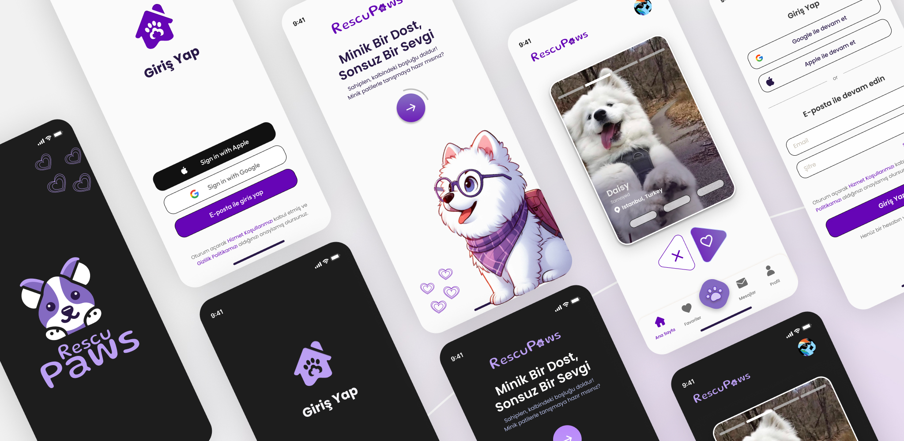
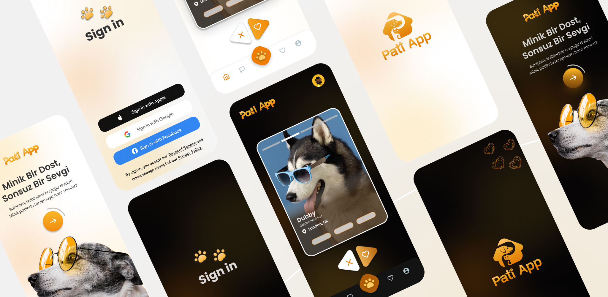

# RescuPaws 🐾

<div align="center">

  


  **Find Your Furry Soulmate in Just 2 Taps.**

  [](https://flutter.dev/)
  [](https://dart.dev/)
  [](https://firebase.google.com/)
  [](https://riverpod.dev/)

</div>

---

## 📖 About The Project

**RescuPaws** is a modern, Tinder-style pet adoption application designed to bridge the gap between homeless pets and loving families. In a world where millions of animals are waiting for a second chance, RescuPaws makes the process of finding your new best friend seamless, fast, and engaging.

We believe that **adoption should be celebrated, not complicated.** By leveraging a "swipe-right" mechanism, we bring a familiar and fun user experience to the serious and noble cause of animal rescue.

### 🌟 Why Adopt?
*Animal rights and welfare are at the core of our mission.*
Every year, countless animals end up in shelters. Adopting a pet saves two lives: the one you adopt and the one who takes their place in the shelter. RescuPaws advocates for **#AdoptDontShop**, promoting the idea that love doesn't have a price tag and that every animal deserves a warm home, fast.

---

## ✨ Key Features

*   **⚡ 2-Tap Adoption:** A streamlined process designed to be as fast as possible. See a pet you love? Connect in seconds.
*   **❤️ Tinder-Like Swiping:** An intuitive, card-based interface to browse through adoptable pets near you. Swipe right to favorite, swipe left to pass.
*   **🎨 Premium UI/UX:** A visually stunning interface designed in **Figma**, featuring smooth animations, glassmorphism elements, and a vibrant color palette (using `FlexColorScheme`).
*   **🔐 Secure Authentication:** Seamless sign-in with Google, Apple, or Email via Firebase Auth.
*   **📍 Location-Based:** Find pets closest to you with integrated location services.
*   **📸 Rich Profiles:** Detailed pet profiles with multi-image galleries and essential information.

---

## 🛠 Technical Architecture

RescuPaws is built with scalability and performance in mind, utilizing the latest advancements in the Flutter ecosystem.

*   **Framework:** [Flutter](https://flutter.dev/) (SDK >=3.22.0)
*   **Architecture:** **MVVM** (Model-View-ViewModel) for clean separation of concerns and testability.
*   **State Management:** [Riverpod](https://riverpod.dev/) (v3.0.0-dev) - Leveraging the latest capabilities for robust state handling.
*   **Backend & Cloud:**
    *   **Firebase:** Authentication, Cloud Firestore (Database), Storage.
    *   **REST API:** Integrated via [Dio](https://pub.dev/packages/dio) and [Retrofit](https://pub.dev/packages/retrofit) for external data handling.
    *   **Supabase:** (Optional/Hybrid integration for backend services).
*   **Navigation:** [GoRouter](https://pub.dev/packages/go_router) for declarative routing and deep linking.
*   **Local Storage:** [Hive](https://pub.dev/packages/hive) & [GetStorage](https://pub.dev/packages/get_storage) for efficient local caching.
*   **Code Generation:** Utilizes `build_runner`, `freezed`, `json_serializable`, and `riverpod_generator` to reduce boilerplate and ensure type safety.
*   **External Assets:** Material Design 3, Ionicons, Lottie Animations.

---

## 🚀 Getting Started

To get a local copy up and running, follow these simple steps.

### Prerequisites

*   Make sure you have Flutter installed.
    ```bash
    flutter doctor
    ```

### Installation

1.  **Clone the repo**
    ```bash
    git clone https://github.com/yourusername/rescupaws.git
    ```
2.  **Install packages**
    ```bash
    flutter pub get
    ```
3.  **Run Code Generation**
    Since this project uses Freezed and Riverpod Generator, you need to run the build runner:
    ```bash
    dart run build_runner build --delete-conflicting-outputs
    ```
4.  **Run the App**
    ```bash
    flutter run
    ```

---

## 📱 Screenshots

<div align="center">
  <!-- Replace these with your actual screenshots -->
  
  
  
  
</div>

---

## 🤝 Contributing

Contributions are what make the open source community such an amazing place to learn, inspire, and create. Any contributions you make are **greatly appreciated**.

1.  Fork the Project
2.  Create your Feature Branch (`git checkout -b feature/AmazingFeature`)
3.  Commit your Changes (`git commit -m 'Add some AmazingFeature'`)
4.  Push to the Branch (`git push origin feature/AmazingFeature`)
5.  Open a Pull Request

---

## 🕰️ Project History & Evolution

**From "Pati Pati" to "RescuPaws"**

Every great project has a story. This application began its journey under the name **"Pati Pati"**. The original design reflected our initial vision for a friendly, warm pet adoption experience.

While we transitioned to **RescuPaws** and refreshed the UI/UX to better serve a broader audience and align with new design standards, the original "Pati Pati" concept remains a core part of our DNA. We are proud of where we started and how far we've come.

<div align="center">
  
  <p><em>The original "Pati Pati" design concept.</em></p>
</div>

---

## 📝 License

Distributed under the MIT License. See `LICENSE` for more information.

---

<div align="center">
  <p>Made with ❤️ for paw friends everywhere.</p>
</div>
